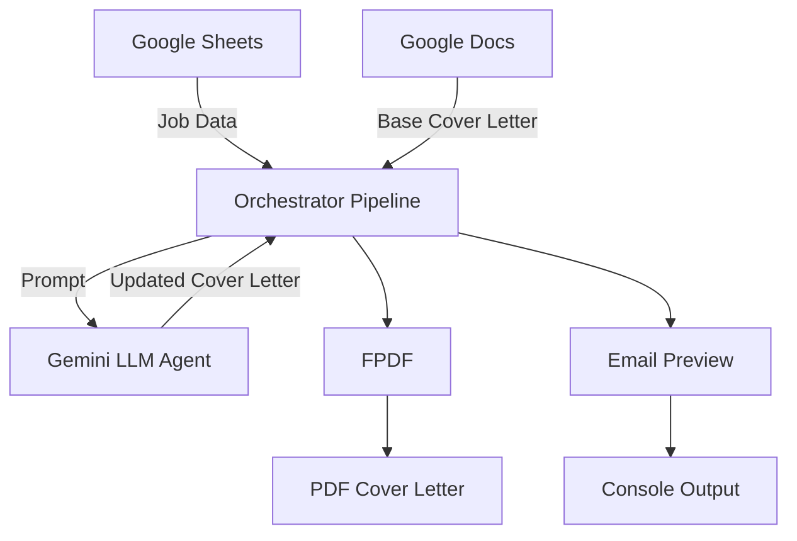

# CoMail AI – **Automated CV Tailoring & Cold Email Job Outreach Agent**

## Capstone Project – Concierge Agent Track - Multi-Agent Pipeline


## Table of Contents
- [Project Overview](#project-overview)
- [Problem Statement](#problem-statement)
- [Solution](#solution)
- [Value Proposition](#value-proposition)
- [Architecture](#architecture)
- [Features](#features)
- [Setup & Installation](#setup--installation)
- [How to Run](#how-to-run)
- [Example Output](#example-output)
- [Evaluation & Rubric Alignment](#evaluation--rubric-alignment)
- [Future Work / Extensions](#future-work--extensions)
- [License](#license)

---

## Project Overview
**CoMail AI** is a multi-agent pipeline designed to automate the rewriting and customization of cover letters for job applications. By integrating Google Sheets and Docs with a Gemini-powered AI agent, this pipeline:

1. Fetches job postings from Google Sheets.
2. Retrieves a base cover letter from Google Docs.
3. Uses the Gemini LLM agent to rewrite the cover letter according to each job description.
4. Generates a PDF of the rewritten cover letter.
5. Prints an email preview for review.

This project demonstrates an end-to-end **Concierge Agent workflow** that reduces manual effort in applying for jobs.

---

## Problem Statement
Manually rewriting cover letters for each job posting is **time-consuming** and often inconsistent in tone, structure, and personalization. Job seekers spend hours tailoring applications without guaranteed results.

---

## Solution
CoMail AI leverages AI agents to automate the process:

- **Input:** Google Sheet with job postings and a Google Doc with a base cover letter.
- **Processing:** Gemini LLM agent rewrites each cover letter to match job descriptions.
- **Output:** PDF of the customized cover letter and a printed email preview for review.

This solution **saves time**, ensures **professional tone**, and **personalizes applications** efficiently.

---

## Value Proposition
- Reduces hours spent on manual cover letter customization.
- Provides a consistent, professional format.
- Personalizes each cover letter to align with specific job descriptions.
- Scalable to handle multiple job applications in one run.

---

## Architecture


---

## Components:

1. **Data Layer:** Google Sheets & Google Docs for job info and base cover letter.
2. **Processing Layer:** Orchestrator pipeline that handles sequential job processing.
3. **Agent Layer:** Gemini LLM agent for rewriting cover letters.
4. **Output Layer:** PDF files and email preview prints.

---

## Features

* **Data Integration:** Reads jobs and cover letters from Google services.
* **Agent Use:** Gemini LLM rewrites letters automatically.
* **PDF Generation:** Converts text to professionally formatted PDFs.
* **Error Handling:** Logs errors and continues processing other jobs.
* **Email Preview:** Simulates email sending without actual delivery.

---

## Setup & Installation

### Requirements

* Python 3.9+
* Libraries: `pandas`, `requests`, `fpdf`, `google-genai`, `google-adk`
* Access to:

  * Google Sheet with job postings
  * Google Doc with base cover letter
  * Google API key or Kaggle secrets

### Install Dependencies

```bash
pip install pandas requests fpdf google-genai google-adk
```

### Secrets Configuration

* Set environment variables or Kaggle secrets for:

  * `SPREADSHEET_ID`
  * `FILE_ID`
  * `GOOGLE_API_KEY`

---


3. Output:

   * PDFs named `cover_letter_job_<job_id>.pdf`
   * Email previews printed in console.

---

## Example Output

```
Found 3 job rows. Processing sequentially...

--- Processing job 1/3: Data Engineer (id=101) ---
✅ Saved updated cover letter: /path/cover_letter_job_101.pdf

📧 EMAIL PREVIEW
To: recruiter@example.com
Subject: Application for Data Engineer

Dear John Doe,

I am writing to express interest in the Data Engineer role. Please find my updated cover letter attached and below...

--- Attachment (cover letter PDF saved) ---
/path/cover_letter_job_101.pdf
```

---


## Future Work / Extensions

## Sequential Workflows - The Assembly Line

Multi-Agent: Sequential 
Architecture: Comail AI agent pipeline 

User input : Get the job description from google sheet and update the cover letter, draft email and send to reciter/hiring manager

```
Info extractor Agent —> Cover letter generation Agent --> Draft Email Agent ——> Send Email Agent —> Editor Agent —> Output
```

info_file: We provide a file that has list of email ids, name of recruiter/hiring manager, company name. 

1. Info extractor Agent : extract required information from info_file 
2. Cover letter generation Agent: Role specific Cover letter generation
3. Draft Email Agent: Recruiter outreach email creation
4. Send Email Agent: Send email to recruiter with attachment (Email + Cover letter + Resume)
5. Editor Agent: Edits the draft copy of email.

We have implemented 3 of the agents i.e. [Info extractor Agent, Cover letter generation Agent, Draft Email Agent] which are working as expected, and 
the last two agents i.e. [Send Email Agent and Editor Agent] are for future work. In summary, below are the work in progress :

* **Automated Email Sending:** Integrate SMTP or Gmail API for direct submission.
* **Interactive UI:** Allow users to upload job postings and base cover letters via a web interface.
* **Enhanced LLM Capabilities:** Integrate multiple agents for skill-based or role-specific customization.
* **Deployment:** Deploy agent pipeline using Google Cloud Run or AWS Lambda for serverless execution.

---

## License

MIT License

---


